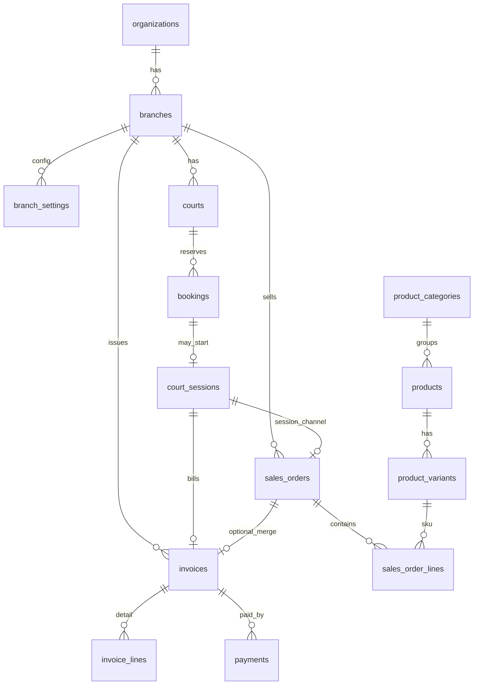

# Target Schema — Badminton Digital

CTO target data model for a **branch-aware** badminton center OS: courts, booking, session POS, catalog, inventory ledger, billing, and growth modules.

See [MIGRATION_ROADMAP.md](./MIGRATION_ROADMAP.md) for how to get there from the current schema.

---

## 1. Design principles

1. **`branch_id` on operational data** — Every court, sale, and stock movement belongs to a site (required for multi-branch and franchise).
2. **Ledgers for money and stock** — Balances are derived from `payments` and `stock_movements`, not silent column updates.
3. **Orders before payments** — `sales_orders` → `invoices` → `payments`; court time is an invoice line, not a orphan total.
4. **Session is a sales channel** — `sales_orders.channel = 'session'` replaces `session_extras` as the long-term model.

---

## 2. Entity catalog (by bounded context)

### Organization

| Table | Purpose |
|-------|---------|
| `organizations` | Legal entity (tax id, name) |
| `branches` | Physical center (timezone, address) |
| `branch_settings` | Key/value JSON per branch (branding, VietQR, hours) |

### Identity & access

| Table | Purpose |
|-------|---------|
| `roles`, `permissions`, `role_permissions` | RBAC beyond admin/employee/customer |
| `users` | Login identity |
| `user_branch_assignments` | Which branches a staff user may access |
| `employees`, `customers` | Staff and CRM profiles |

> **Shipped so far:** a `branch_manager` role landed in `roles`
> (`20260815300002-add-branch-manager-role.js`) as a fourth hardcoded role name
> checked in `roleMiddleware([...])` arrays — `permissions`/`role_permissions`
> do not exist yet, so this is still name-based authorization, not the
> permission-code RBAC this section targets. There is no
> `user_branch_assignments` table either; branch access for staff is still a
> single `employees.branch_id` (one branch per employee), with `admin` alone
> able to view any branch at request time via `X-Branch-Id`
> (`branchContextMiddleware.js`) rather than an explicit assignment table.
> Separately, `customers` became chain-wide — `branch_id` was dropped from it
> (`20260815300001-unify-customers-chain-wide.js`) so one customer profile is
> shared across all branches; only `bookings`/`court_sessions`/`invoices`/
> `payments` still carry `branch_id` to record where a transaction happened.

### Court & booking

| Table | Purpose |
|-------|---------|
| `court_types` | Standard vs premium courts |
| `courts` | Play surfaces per branch |
| `court_price_rules` | Peak/off-peak by day and effective dates |
| `court_blocks` | Manual closures (events, holidays) |
| `court_maintenance_logs` | Repair history |
| `bookings` | Reserved slots |
| `court_sessions` | Live play |
| `booking_deposits` | (M6) Prepay linked to payments |

### Catalog & sales

| Table | Purpose |
|-------|---------|
| `product_categories` | Drinks, shuttles, grips, … |
| `products`, `product_variants` | Sellable/rentable SKUs |
| `product_barcodes`, `product_images` | POS scan & storefront |
| `sales_orders`, `sales_order_lines` | POS / session / online carts |

**Legacy:** `extras`, `session_extras` — target was to retire these after the M2 backfill, but as of the M4 inventory work landing, this has not happened: `extras`/`session_extras` remains the only live sales path (`products`/`product_variants`/`sales_orders` have no application code), and M4's stock ledger was built on `extras`, not `product_variants`. See `MIGRATION_ROADMAP.md`.

### Inventory & procurement (M4+)

| Table | Purpose |
|-------|---------|
| `warehouses`, `warehouse_locations` | Main store vs counter |
| `stock_levels` | On-hand and reserved per variant |
| `stock_movements`, `stock_movement_lines` | Audit trail (sale, receipt, adjust, …) |
| `suppliers`, `purchase_orders`, `goods_receipts` | Restock shuttlecocks |

> **Shipped vs. targeted (M4, `20260815000002-inventory-foundation.js`):** the real
> tables are `suppliers`, `extra_stocks` (not `stock_levels`/`warehouses` — one row
> per `(extra_id, branch_id)`, no warehouse/location concept), `stock_movements`
> (matches; no `stock_movement_lines` split), and `goods_receipts` /
> `goods_receipt_items` (matches `goods_receipts`, but there is no
> `purchase_orders` table — a receipt is created directly, not against a PO).
> Crucially, stock keys off `extra_id` (the legacy flat catalog), not
> `product_variant_id` — the `products`/`product_variants` catalog below was
> never adopted at the app layer, so M4 was built on what actually exists. See
> `MIGRATION_ROADMAP.md` for the full comparison.

### Billing

| Table | Purpose |
|-------|---------|
| `invoices`, `invoice_lines` | Legal/tax-friendly bills |
| `payments` | Idempotent settlement |
| `refunds` | Returns and corrections |

### Growth (Phase 3+)

| Table | Purpose |
|-------|---------|
| `membership_plans`, `memberships` | Member court pricing |
| `vouchers`, `voucher_redemptions` | Campaigns |
| `loyalty_accounts`, `loyalty_transactions` | Points |
| `rental_agreements`, … | Racket rental |
| `expense_categories`, `expenses` | Profit reporting |

### Platform

| Table | Purpose |
|-------|---------|
| `audit_logs` | Who changed money/stock |
| `domain_outbox` | Async notifications and integrations |

---

## 3. Core ERD (M1–M3 scope)



---

## 4. Indexes (M1–M3 minimum)

| Table | Index |
|-------|--------|
| `branches` | UNIQUE `(organization_id, code)` |
| `courts` | `(branch_id, status)` |
| `bookings` | `(branch_id, court_id, booking_date, start_time, end_time)` |
| `court_sessions` | `(branch_id, court_id, status)` |
| `product_variants` | UNIQUE `(sku)` |
| `sales_orders` | `(branch_id, session_id, status)` |
| `sales_order_lines` | `(sales_order_id)` |
| `invoices` | UNIQUE `(branch_id, invoice_no)` |
| `invoice_lines` | `(invoice_id)` |
| `payments` | UNIQUE `(idempotency_key)` where not null |
| `payments` | `(branch_id, confirmed_at, status)` — use `paid_at` until M3 adds `confirmed_at` |

---

## 5. Constraints & rules

| Rule | Enforcement |
|------|-------------|
| One active session per court | Transaction + unique partial logic in `OpenSession` (app); optional generated column in MySQL 8+ later |
| No overlapping confirmed bookings | Serializable transaction or lock row per `(branch_id, court_id, booking_date)` |
| Invoice total = sum(lines) | Application service; reconcile job in Phase 2 |
| Payment idempotency | UNIQUE `idempotency_key` on `payments` |
| Stock changes | M4+: only via `stock_movements` |

---

## 6. Module & folder layout

```
src/modules/
  organization/   # branches, settings
  identity/       # auth, RBAC
  court/          # courts, pricing, maintenance
  booking/
  session/
  catalog/        # products, variants
  sales/          # sales_orders
  billing/        # invoices, payments
  inventory/      # M4+
  reporting/      # read-only
  audit/
```

Cross-module calls go through **application services** or **outbox events**, not direct cross-table updates from random services.

---

## 7. API surface (target)

- Header **`X-Branch-Id`**: required for staff operations (default branch `1` until UI exists).
- Header **`Idempotency-Key`**: required on `POST .../payments` and checkout.
- Resources: `/branches`, `/courts`, `/bookings`, `/sessions`, `/products`, `/sales-orders`, `/invoices`, `/payments`.

Full endpoint list lives in the root [README](../../README.md); expand as modules land.

---

## 8. Phase mapping

| Phase | Schema focus |
|-------|----------------|
| **1 MVP** | M1–M3 + app fixes (idempotent checkout, audit stub) |
| **2 Production** | M4–M6, refunds, deposits, full RBAC |
| **3 Growth** | Membership, vouchers, rental, expenses |
| **4 Enterprise** | Franchise org billing, BIGINT PKs, read replicas, asset module |
